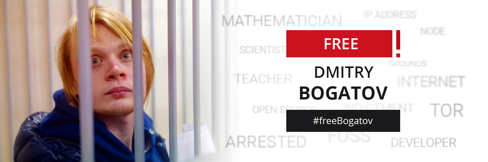

# [freebogatov.xyz](https://freebogatov.xyz/en/)

Support website about jailed russian mathematician and [software developer](https://qa.debian.org/developer.php?email=KAction%40gnu.org) Dmitry Bogatov aka KAction.

## How to build and run

```bash
git clone https://github.com/komachi/freebogatov.xyz && cd freebogatov.xyz
bundle install
bundle exec jekyll serve
```

## How to build and run in [Termux](https://termux.com/)

```bash
apt install git make clang nodejs ruby ruby-dev libffi-dev libxml2-dev libxslt-dev pkg-config
git clone https://github.com/komachi/freebogatov.xyz && cd freebogatov.xyz
gem install bundle pkg-config
gem install nokogiri -- --use-system-libraries
bundle install
bundle exec jekyll serve
```
